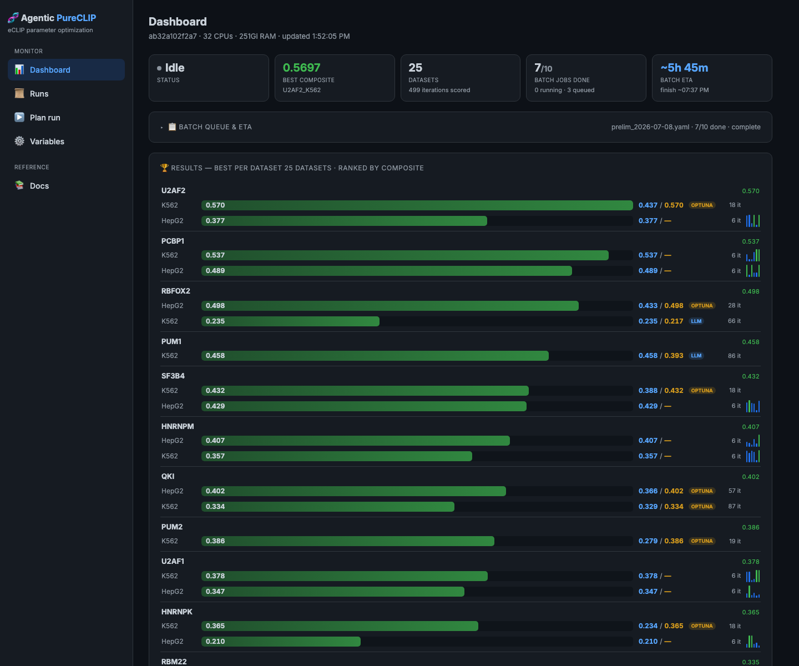

# Agentic PureCLIP

Parameter optimization for **eCLIP** peak calling with
[PureCLIP](https://github.com/skrakau/PureCLIP). An optimizer proposes PureCLIP +
post-processing parameters; for each set the pipeline runs PureCLIP, scores the
result against biological quality signals, and iterates to maximize a composite
quality score. Two interchangeable optimizers share the same evaluation and
objective — an **LLM agent** (DeepSeek, via LangGraph) and **Optuna**
(TPE/Bayesian) — so they can be compared apples-to-apples.

A live **dashboard** tracks every run, and a small **CLI** launches them.



## What it does

From pre-aligned, deduplicated ENCODE BAM files (IP replicates + size-matched
input), the Snakemake pipeline merges IP → runs `pureclip2` → per-replicate
PureCLIP → post-processes to a standardized footprint → scores. The optimizer
loops this, searching for the parameters that give the most trustworthy binding
sites.

### Objective (`agentic_pureclip.scoring.objective::composite_objective`)

```
composite = (0.5·reproducibility + 0.25·motif + 0.25·recall) × min(1, n_sites/10)
```

- **reproducibility** — chance-corrected cross-replicate agreement.
- **motif** — fraction of sites bearing the RBP's RNA motif (log-odds PWM, most-enriched).
- **recall** — fraction of known-strong ENCODE reference regions recovered.
- **collapse guard** — `min(1, n_sites/10)` so collapsing to a few "perfect" sites can't win.

Weights are configurable per run via `priors.objective_weights`.

## Quick start

Toolchain is **uv**; the LLM is **DeepSeek** (`DEEPSEEK_API_KEY` in `.env`).

```bash
uv sync                              # installs the project (editable) + deps
cp .env.example .env                 # add DEEPSEEK_API_KEY (Optuna needs no key)
uv run python -m pytest tests/ -q    # tests (DEEPSEEK_API_KEY=dummy is fine)
```

### Run an optimization

```bash
# LLM agent
CONFIG_PATH=config/run_config.yaml MAX_ITER=8 uv run python -m agentic_pureclip.loop.graph

# Optuna (same eval + objective, no API key)
CONFIG_PATH=config/run_config.yaml MAX_ITER=12 uv run python -m agentic_pureclip.loop.optuna_runner
```

`learn_on_chr21: true` in the config restricts PureCLIP to chr21 ("fast mode",
minutes/iter); set it `false` for a full-genome run (hours/pass). The best
parameters are saved to `config/best_config.yaml`.

### Launch a run with the CLI

`agentic-pureclip-run` is the one command for starting a parameter search — it
writes a standard batch manifest and runs the pipeline within a wall-clock budget,
isolating each job so a single failure never aborts the run. The dashboard's
**Plan run** page builds this exact command for you to copy.

```bash
uv run agentic-pureclip-run \
    --dataset RBFOX2_K562 --optimizer llm \
    --max-iter 8 --hours 4 --threads 32 --chr21 \
    --weight reproducibility=0.5 --weight motif=0.25 --weight recall=0.25 \
    --param pureclip.bandwidth_nt=20:100 --param postprocessing.force_width=3:15
```

It prints a job id and a log path; the dashboard then tracks the run live. Add
`--dry-run` to preview the manifest and launch command without starting anything.
Results accumulate under `results/overnight/` (`iterations.jsonl`, `jobs.jsonl`,
`summary.csv`, `<job>/decisions.jsonl`).

## Dashboard

The dashboard has four pages: **Dashboard** (active run, queue/ETA, and a
per-dataset leaderboard with LLM-vs-Optuna head-to-head), **Runs** (per-iteration
decision trail), **Plan run** (configure a search and copy its CLI command), and
**Variables** (a plain-English guide to every knob).

### View the deployed dashboard

The dashboard runs as a Docker Compose stack on the compute VM. It's bound to the
VM's localhost, so open an SSH tunnel and browse `http://localhost:8080`:

```bash
ssh -N -L 8080:localhost:8080 -p 30121 -i ~/.ssh/id_ed25519 ubuntu@194.94.4.28
# then open http://localhost:8080
```

The dashboard is **read-only monitoring** — it shows live run data but doesn't
launch jobs itself. Start runs with `agentic-pureclip-run` (above); the **Plan
run** page generates that command for you.

Running it yourself (dev servers or the Compose stack) and the deployment details
are in the [developer onboarding guide](docs/developer-onboarding.md).

## Datasets

Registered in `agentic_pureclip.pipeline.datasets` (RBFOX2, QKI, PUM1/PUM2,
U2AF1/U2AF2, and more, across K562 and HepG2). `data/` and `results/` are
gitignored. Regenerate a dataset config:

```bash
python scripts/data/write_dataset_config.py RBFOX2_K562 --out config/datasets/RBFOX2_K562.yaml
```

## Repo layout

The core is one installable package, `src/agentic_pureclip/`, whose subpackages
are the three things this project contributes — the optimization **loop**, the
**scoring**, and the **postprocessing** — plus the plumbing under `pipeline/` and
run-launching under `run/`.

| Path | What |
|------|------|
| `src/agentic_pureclip/loop/` | The optimization loop: `graph.py` (LLM/LangGraph), `optuna_runner.py` (TPE), shared `evaluation.py` / `state.py` / `report.py` |
| `src/agentic_pureclip/scoring/` | Quality signals + objective: `run_scorers.py`, `objective.py` |
| `src/agentic_pureclip/postprocess/` | Standardized footprint + the `Snakefile` |
| `src/agentic_pureclip/pipeline/` | Plumbing: bounds, datasets, motifs (PWM), Snakemake runner |
| `src/agentic_pureclip/run/` | Run scheduling shared by the CLI and dashboard (`schedule.py`, `launcher.py`, `cli.py`) |
| `scripts/` | Ops utilities: `data/`, `motifs/`, `run/` |
| `dashboard/` | The dashboard: `api/` (FastAPI) + `ui/` (React SPA) + `proxy/` (Caddy), `docker-compose.yml` at the repo root |
| `config/`, `tests/`, `docs/` | Run/dataset configs; pytest suite; architecture notes, onboarding, and the thesis (`docs/report/`) |

## Compute VM

Long runs and the dashboard live on the VM at
`/vol/storage1/johannes/projects/agentic-pureclip`. `pureclip2` is not on the
default PATH — prepend `/vol/storage1/johannes/projects` (the CLI's
`--pureclip-dir` defaults to this). Container images are stored on
`/vol/storage1` (the root disk is small); see the onboarding guide for details.
